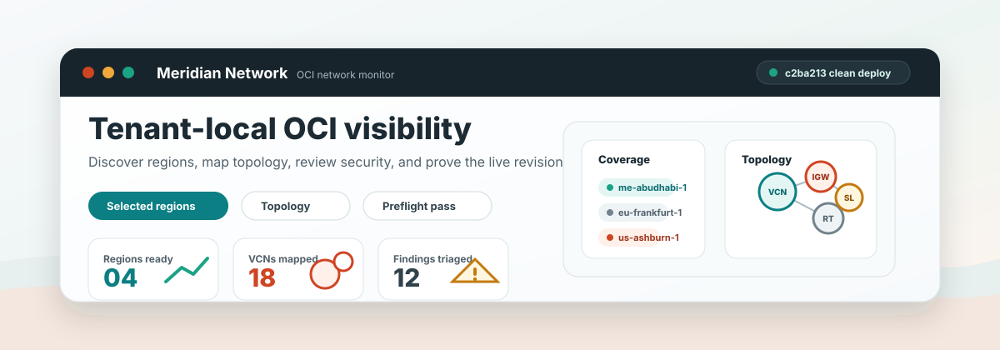

# Meridian Network



Meridian is a self-hosted OCI Network Monitor for consolidated network observability across compartments and regions.

It includes the deployable OCI baseline, backend API, buildable dashboard artifact, and operating documentation needed to run Meridian on an OCI Compute VM.

## Why Meridian

Meridian is meant for teams that need a practical, tenant-local view of OCI networking without starting from a heavy platform rollout.
It runs close to the environment it observes, uses OCI-native authentication patterns, and focuses on the questions that usually come up during operations, reviews, migrations, and customer workshops:

- Which regions and compartments are actually in scope?
- Which VCNs, subnets, gateways, route tables, security lists, and NSGs exist?
- Where are public routes, broad ingress rules, or zero-resource regions?
- Is the runtime identity allowed to read the networking data the dashboard needs?
- What exact version of the dashboard/API is deployed on the VM?

It is intentionally small enough to understand and adapt, but structured enough to be deployed repeatedly with Terraform and Ansible.

## Use Cases

- **OCI network discovery**: build a fast inventory of VCNs, subnets, gateways, route tables, security lists, and NSGs across selected regions.
- **Multi-region visibility**: avoid noisy global views by selecting the exact regions you want to inspect.
- **Security posture review**: highlight public SSH/RDP exposure, broad public egress, public web ingress, and related network findings.
- **Route and topology analysis**: understand how VCN resources connect through gateways, routes, and subnet associations.
- **Migration and landing-zone reviews**: validate what exists before or after a migration, region expansion, or landing-zone rollout.
- **Customer demos and workshops**: use the `/demodata` mode for safe demonstrations, then switch to live OCI mode for real environments.
- **Operational validation**: use preflight checks to confirm instance principal access, tenancy configuration, compartment scope, and required OCI read permissions.
- **Deployment traceability**: confirm the deployed Git revision through `/api/version` and `/version.json`.

## Connectivity Checks, Without Surprise Bills

When someone says "VM A cannot reach VM B", start with **Connectivity Check** in the dashboard.
Enter the exact source, destination, protocol, port, and direction, then click **Check connectivity**.

That button uses OCI Network Path Analyzer. It reads network configuration and asks OCI why the path works or fails.
It does **not** enable VCN Flow Logs, does **not** start packet collection, and reports `cost_impact: no_flow_logs_enabled`.

If the path is blocked, Meridian points you at the usual suspects first:

- Security List or NSG ingress/egress rules.
- Missing route rules, blackhole routes, DRG attachment gaps, or asymmetric return paths.
- OCI Network Path Analyzer service-limit issues in very large tenancies.

Use **Enable telemetry** only when path analysis is not enough and you need packet-level evidence.
That flow is intentionally scoped to the VCN the customer picks, asks for confirmation, and can be turned off again with
**Disable telemetry** after the investigation. Any telemetry enablement is leased for 60 minutes max and the VM sweeper
disables/cleans up expired Meridian-created Flow Logs even if the browser is closed. By default, the dashboard cannot
create Flow Logs unless the operator explicitly sets `MERIDIAN_TRAFFIC_FLOW_LOGS_ENABLEMENT_ALLOWED=true`.

Quick guide for the panel:

- Pick source type: IP address is easiest; instance, VNIC, and subnet OCIDs are useful when you want OCI to reason from a resource.
- Fill source and destination with exact values. Avoid broad CIDR guesses for the first pass.
- Pick protocol and destination port. Use `ICMP` only when you are testing ping-style reachability.
- Use **Bi-directional** for normal application traffic because return routing matters.
- Read **Status**, **Forward**, **Return**, and the hop table after the check.
- Treat the telemetry badge separately. `telemetry locked` means Flow Log creation is blocked for cost safety; it does not mean the network path is blocked.
- Telemetry supports multiple explicitly selected VCNs. That is useful for VM-in-VCN-A to VM-in-VCN-B checks, while the 60-minute lease protects cleanup.

## Interested in Implementing It?

If you are interested in implementing, adapting, or discussing Meridian for an OCI environment, contact:

**Leandro Michelino, Oracle ACE**

`leandro.michelino@oracle.com`

## Current Repository Status

- Remote: `https://github.com/leandro-michelino/meridiannetwork.git`
- Branch: `main`
- Initial remote content reviewed: `LICENSE`
- Local baseline added: Terraform, Ansible, docs, and helper scripts.

## What Is Included

- Terraform for OCI workload compartment, VCN, public subnet, internet gateway, optional NAT gateway, route table, security lists, optional Object Storage archive, and Compute host.
- Optional OCI dynamic group and IAM policy for instance principal access.
- FastAPI backend foundation with health, readiness, preflight, regions, compartments, connectivity, and traffic telemetry endpoints.
- Buildable frontend artifact for the API-aware dashboard with fallback demo data, live refresh, selected-region coverage, saved region views, draggable topology, quick topology filters, subnet access labels, NSG context, resource IDs, expanders, pinned home-region navigation, and exact-resource connectivity checks.
- Dashboard topbar access validation button for runtime IAM, region, compartment, and network read validation.
- Ansible bootstrap to configure Oracle Linux with Nginx, Podman-ready packages, firewall rules, cache-safe dashboard publishing, deployment version metadata, and the backend API service.
- Inventory generation from Terraform outputs.
- Documentation for architecture, operations, security/IAM, API design, data model, roadmap, release process, and remote audit.
- Manual local validation commands for Terraform and Ansible.

## Repository Layout

```text
.
|-- ansible/                 # Host configuration and dashboard publishing
|-- backend/                 # FastAPI backend and tests
|-- docs/                    # Architecture, operations, security, API, roadmap
|-- frontend/                # Build scripts and frontend source helpers
|   |-- scripts/build.mjs     # Builds frontend/dist from the source HTML
|   `-- src/                 # Build info and HTML injection helpers
|-- scripts/                 # Local helper scripts
|-- terraform/               # OCI infrastructure as code
|-- tests/e2e/               # Browser E2E coverage for the dashboard
|-- Makefile                 # Common local commands
`-- oci_network_monitor_dashboard_v2.html
```

## Prerequisites

- Terraform 1.6 or newer.
- Ansible 2.15 or newer.
- Node.js 20 or newer for the frontend build script.
- OCI credentials configured through an OCI CLI profile, environment variables, or another supported OCI provider auth mode.
- An SSH public key available locally, for example `~/.ssh/id_rsa.pub` or `~/.ssh/id_ed25519.pub`.
- OCI permissions to create networking, compute, and optionally IAM resources.

## Quick Start

Copy the example variables file:

```bash
cp terraform/terraform.tfvars.example terraform/terraform.tfvars
```

Edit `terraform/terraform.tfvars` with:

- `tenancy_ocid`
- `compartment_ocid`, or `parent_compartment_ocid` with `create_meridian_compartment = true`
- `region`
- `admin_cidr_blocks`
- `ssh_public_key_path`

Initialize and validate:

```bash
make tf-init
make tf-plan
```

Create the OCI baseline:

```bash
make tf-apply
```

Configure the host and publish the built dashboard artifact:

```bash
make deploy
```

Open the URL printed by Terraform output `app_url`.

The deployment publishes `/version.json` and the backend exposes `GET /api/version`; both include the Git revision deployed to the VM.

## Common Commands

```bash
make help
make tf-init
make tf-validate
make tf-plan
make tf-apply
make inventory
make ping
make frontend-build
make deploy
make tf-destroy
make backend-install
make backend-test
make dashboard-e2e
make backend-run
```

## Validation Policy

This repository intentionally does not use GitHub Actions or other Git automation. Run validation locally before pushing changes.

Use [docs/manual-validation.md](docs/manual-validation.md) as the source of truth for manual checks.

## Backend Development

Install backend development dependencies:

```bash
make backend-install
```

Run tests:

```bash
make backend-test
```

Run the API locally:

```bash
make backend-run
```

Local endpoints:

- `GET /healthz`
- `GET /readyz`
- `GET /api/version`
- `GET /api/preflight`
- `GET /api/regions/available`
- `GET /api/regions/active`
- `GET /api/compartments`
- `GET /api/vcns`
- `GET /api/subnets`
- `GET /api/gateways`
- `GET /api/route-tables`
- `GET /api/route-issues`
- `GET /api/security-lists`
- `GET /api/network-security-groups`
- `GET /api/topology`
- `GET /api/security/posture`
- `POST /api/connectivity/check`
- `GET /api/traffic/telemetry/status`
- `POST /api/traffic/telemetry/enable`
- `POST /api/traffic/telemetry/disable`
- `GET /api/traffic/flows`
- `GET /docs`

## OCI Authentication

Terraform uses the OCI provider and defaults to `config_file_profile = "DEFAULT"`.

To use another profile, set `oci_profile` in `terraform/terraform.tfvars`.

If your OCI config file is not in the default location, export:

```bash
export OCI_CONFIG_FILE=/path/to/config
```

For runtime inventory scope, set monitored compartments explicitly when you do not want the API to use the tenancy root
as the default compartment scope:

```bash
export MERIDIAN_COMPARTMENT_IDS=ocid1.compartment.oc1..example,ocid1.compartment.oc1..example2
```

## IAM Model

`create_identity_policies` is disabled by default because IAM policy creation usually requires tenancy-level privileges.

When enabled, Terraform creates:

- A dynamic group matching Compute instances in the application compartment.
- A read-oriented policy intended for instance principal access to network observability data.

The deployed API exposes `GET /api/preflight`, and the dashboard includes a topbar `Validate access` button to validate
runtime authentication, compartment discovery, configured regions, monitored compartments, and required networking read
permissions on demand.

Review [docs/security-and-iam.md](docs/security-and-iam.md) before enabling IAM creation in a shared tenancy.

## Cost Safety Defaults

Meridian is deliberately boring about costs:

- The dashboard does not check or enable Flow Logs on page load.
- Connectivity Check uses OCI Network Path Analyzer first.
- Flow Log enablement requires `MERIDIAN_TRAFFIC_FLOW_LOGS_ENABLEMENT_ALLOWED=true` and matching OCI IAM permissions.
- The telemetry buttons work on selected VCNs, not every VCN in the tenancy.
- Telemetry leases are capped at 60 minutes and automatically cleaned up by the VM.
- Customers can disable Meridian-created Flow Logs from the same panel when the troubleshooting window is done.

## Documentation

- [Architecture](docs/architecture.md)
- [Operations Runbook](docs/operations.md)
- [Security and IAM](docs/security-and-iam.md)
- [API Reference](docs/api-reference.md)
- [Data Model](docs/data-model.md)
- [Deployment Checklist](docs/deployment-checklist.md)
- [Deployment Options](docs/deployment-options.md)
- [Manual Validation](docs/manual-validation.md)
- [Module Map](docs/module-map.md)
- [Roadmap](docs/roadmap.md)
- [Release Process](docs/release-process.md)
- [Remote Audit](docs/remote-audit.md)
- [Security Policy](SECURITY.md)
- [Backend README](backend/README.md)
- [Terraform README](terraform/README.md)
- [Ansible README](ansible/README.md)

## First Production Hardening Items

- Move Terraform state to a remote backend.
- Replace direct public HTTP with HTTPS through an OCI Load Balancer or reverse proxy certificate.
- Narrow `admin_cidr_blocks` to VPN or office IP ranges.
- Continue splitting the dashboard source into frontend modules as it grows.
- Add monitoring alarms for the Meridian host itself.
